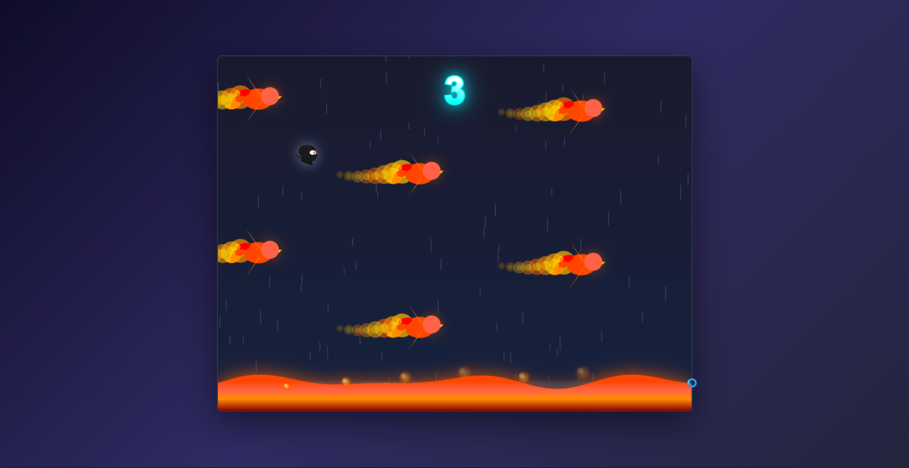

# Kiro Ninja

A browser-based endless runner game where you guide Ghosty through a stormy night, dodging fire-breathing phoenix birds while avoiding the lava below.

## Game Features

- **Dynamic Weather Effects**: Rain and lightning create an atmospheric stormy environment
- **Phoenix Obstacles**: Fire-breathing phoenix birds with animated wings and flame trails
- **Lava Floor**: Animated lava with bubbles and wave effects
- **Score Tracking**: Local high score persistence
- **Visual Effects**: Explosions, glowing sprites, screen shake, and particle effects
- **Sound Effects**: Jump and game over audio feedback

## How to Play

1. Open `index.html` in a web browser
2. Press **SPACE** to start the game
3. Press **SPACE** to make Ghosty jump
4. Avoid the phoenix birds and don't hit the lava floor
5. Score points by passing through gaps between phoenixes

## Game Mechanics

- Gravity-based physics with jump controls
- Collision detection with phoenix bodies (not fire trails)
- Progressive difficulty with continuous obstacle spawning
- High score saved to browser local storage

## Resources

- `index.html` - Complete game (HTML5 Canvas + JavaScript)
- `assets/ghosty.png` - Player sprite
- `assets/jump.wav` - Jump sound effect
- `assets/game_over.wav` - Game over sound effect
- `img/example-ui.png` - Screenshot

## Technical Details

- Pure HTML5 Canvas rendering
- No external dependencies
- Responsive gradient backgrounds
- Particle system for explosions
- Procedural animation for weather and lava effects