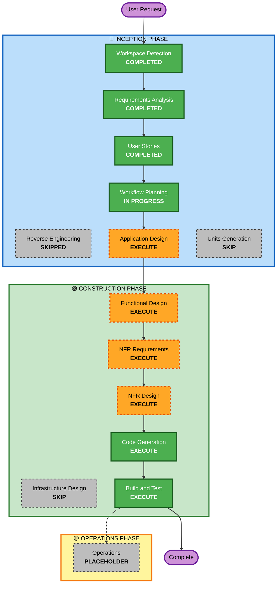

# Execution Plan - Kiro Dash

## Detailed Analysis Summary

### Project Type
**Greenfield Project** - Building new game from scratch

### Change Impact Assessment
- **User-facing changes**: Yes - Complete new game with player interactions
- **Structural changes**: Yes - New game architecture and systems
- **Data model changes**: Yes - Game state, entities, collectibles, power-ups
- **API changes**: N/A - No external APIs
- **NFR impact**: Yes - Performance (60 FPS), responsiveness, browser compatibility

### Risk Assessment
- **Risk Level**: Medium
- **Complexity**: Moderate - Multiple game systems (movement, collision, power-ups, scoring)
- **Rollback Complexity**: Easy - Single-file deployment, no database
- **Testing Complexity**: Moderate - Manual gameplay testing, collision detection validation

---

## Workflow Visualization

### Text-Based Workflow
```
INCEPTION PHASE (🔵):
  ✓ Workspace Detection - COMPLETED
  ✗ Reverse Engineering - SKIPPED (Greenfield)
  ✓ Requirements Analysis - COMPLETED
  ✓ User Stories - COMPLETED
  ✓ Workflow Planning - IN PROGRESS
  → Application Design - EXECUTE
  ✗ Units Generation - SKIP

CONSTRUCTION PHASE (🟢):
  → Functional Design - EXECUTE
  → NFR Requirements - EXECUTE
  → NFR Design - EXECUTE
  ✗ Infrastructure Design - SKIP
  → Code Generation - EXECUTE (ALWAYS)
  → Build and Test - EXECUTE (ALWAYS)

OPERATIONS PHASE (🟡):
  ⊗ Operations - PLACEHOLDER
```

### Mermaid Diagram



---

## Phases to Execute

### 🔵 INCEPTION PHASE

- [x] **Workspace Detection** - COMPLETED
  - Determined greenfield project with existing assets

- [x] **Reverse Engineering** - SKIPPED
  - **Rationale**: Greenfield project, no existing code to analyze

- [x] **Requirements Analysis** - COMPLETED
  - Gathered comprehensive functional and non-functional requirements

- [x] **User Stories** - COMPLETED
  - Created 20 user stories with 2 personas

- [x] **Workflow Planning** - IN PROGRESS
  - Creating execution plan

- [ ] **Application Design** - EXECUTE
  - **Rationale**: Need to define game architecture, component structure, and system design
  - **Deliverables**: Component diagram, game loop design, state management, entity relationships

- [ ] **Units Generation** - SKIP
  - **Rationale**: Single-file game implementation, no need to decompose into multiple units
  - **Note**: All code will be generated as one cohesive unit

---

### 🟢 CONSTRUCTION PHASE

- [ ] **Functional Design** - EXECUTE
  - **Rationale**: Need detailed design for game mechanics, collision detection, scoring system, power-up logic
  - **Deliverables**: Game state model, entity classes, collision algorithms, scoring formulas

- [ ] **NFR Requirements** - EXECUTE
  - **Rationale**: Performance (60 FPS), browser compatibility, responsive design requirements need assessment
  - **Deliverables**: Performance targets, compatibility matrix, optimization strategies

- [ ] **NFR Design** - EXECUTE
  - **Rationale**: Need to incorporate performance patterns, efficient rendering, memory management
  - **Deliverables**: Rendering optimization, game loop design, asset loading strategy

- [ ] **Infrastructure Design** - SKIP
  - **Rationale**: Static HTML file deployment, no infrastructure components needed
  - **Note**: Simple file hosting, no CDK/Terraform required

- [ ] **Code Generation** - EXECUTE (ALWAYS)
  - **Rationale**: Implementation of game code
  - **Deliverables**: index.html with embedded CSS/JavaScript, game implementation

- [ ] **Build and Test** - EXECUTE (ALWAYS)
  - **Rationale**: Validation and testing instructions
  - **Deliverables**: Manual testing checklist, browser compatibility testing, gameplay validation

---

### 🟡 OPERATIONS PHASE

- [ ] **Operations** - PLACEHOLDER
  - **Rationale**: Future deployment and monitoring workflows
  - **Note**: Currently all build/test handled in Construction phase

---

## Execution Summary

**Total Stages to Execute**: 8
- Inception: 2 stages (Application Design, Workflow Planning completion)
- Construction: 5 stages (Functional Design, NFR Requirements, NFR Design, Code Generation, Build and Test)

**Total Stages to Skip**: 4
- Inception: 2 stages (Reverse Engineering, Units Generation)
- Construction: 1 stage (Infrastructure Design)
- Operations: 1 stage (Operations - placeholder)

**Estimated Timeline**: 
- Application Design: ~30 minutes
- Functional Design: ~30 minutes
- NFR Requirements: ~15 minutes
- NFR Design: ~20 minutes
- Code Generation: ~45 minutes
- Build and Test: ~15 minutes
- **Total**: ~2.5 hours

---

## Success Criteria

### Primary Goal
Create a fully functional Kiro Dash endless runner game playable in web browsers

### Key Deliverables
1. Complete game implementation (HTML/CSS/JavaScript)
2. All 20 user stories implemented
3. 60 FPS performance achieved
4. Responsive design working
5. High score persistence functional
6. Audio system operational

### Quality Gates
- ✓ All Must-Have user stories implemented
- ✓ Game runs smoothly at 60 FPS
- ✓ Collision detection works accurately
- ✓ Controls are responsive (< 50ms latency)
- ✓ High score persists across sessions
- ✓ Works in Chrome, Firefox, Safari, Edge
- ✓ Responsive on different screen sizes

---

## Next Steps

1. **Approve this execution plan**
2. **Proceed to Application Design** - Define game architecture and component structure
3. **Continue through Construction phases** - Design and implement game
4. **Complete with Build and Test** - Validate and test game functionality

---
